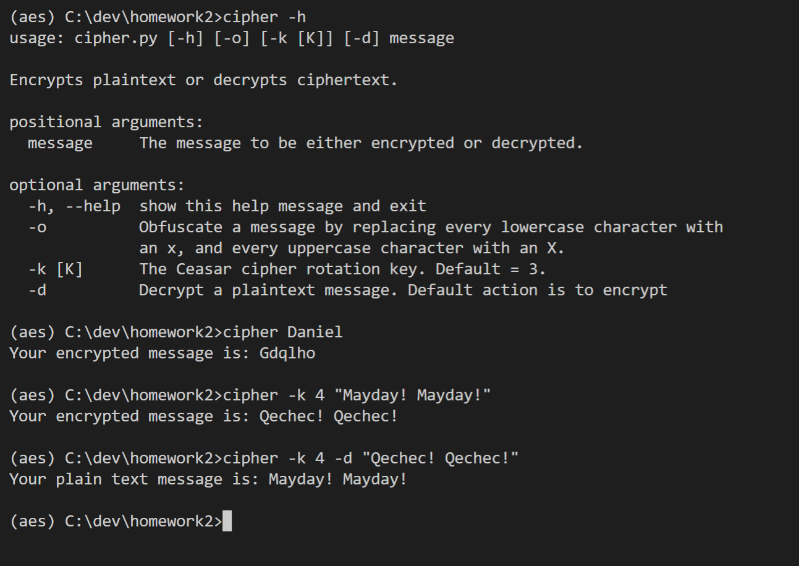

```{r setup, include=FALSE}
knitr::opts_chunk$set(echo = TRUE)
```


## Exercise 1 : Simple Substitution Cipher

The goal of this exercise is to write a cyclic cipher to encrypt messages. This type of cipher was used by Julius Caesar
to communicate with his generals. It is very simple to generate but it can actually be easily broken and does not provide the
security one would hope for.

Turn in a copy of the program and a screen capture of the program in action.

``` 
import sys 
import argparse

def encrypt(plaintext, k):
	cipher = ''
	
	for letter in plaintext:
		c = ord(letter)
		
		if (c >= 65 and c <= 90):
			c = (c + k) % 91
			if c < 65:
				c+=65

		elif (c >= 97 and c <= 122):
			c = (c + k) % 123
			if c < 97:
				c+=97
			
		cipher += chr(c)
		
	print ('Your encrypted message is: ' + cipher)

def decrypt(ciphertext, k):
	plaintext = ''
	
	for letter in ciphertext:
		c = ord(letter)		
		
		if (c >= 65 and c <= 90):
			c = (c-k-64) % (90-64) + 64
			if c < 65:
				c += 66

		elif (c >= 97 and c <= 122):
			c = (c-k-96) % (122-96) + 96
		
		plaintext +=chr(c)

		
	print ('Your plain text message is: ' + plaintext)

def obfuscate(message):
	obfuscated = ''

	for letter in message:
		c = ord(letter)

		if (c >= 65 and c <= 90):
			c = 88
		elif (c >= 97 and c <= 122):
			c = 120
			
		obfuscated += chr(c)

	print ('Your obfuscated message is: ' + obfuscated)

def main():
	parser = argparse.ArgumentParser(description='Encrypts plaintext or decrypts ciphertext.')
	parser.add_argument('message', help='The message to be either encrypted or decrypted.')
	parser.add_argument('-o', action='store_true', help="Obfuscate a message by replacing every lowercase character with an x, and every uppercase character with an X.")
	parser.add_argument('-k', nargs='?', default = 3, const = 3, help='The Ceasar cipher rotation key. Default = 3.')
	parser.add_argument('-d', help='Decrypt a plaintext message. Default action is to encrypt', action='store_true')

	args = parser.parse_args()

	if args.o:
		obfuscate(args.message)
	elif args.d:
		decrypt(args.message, int(args.k))
	else:
		encrypt(args.message, int(args.k))

main()
```



## Exercise 2 : Breaking a Simple Substitution Cipher

The goal of this exercise is to retrieve the key and plaintext used to create a given cipher text string. For this exercise, write
an algorithm that works in better than brute force time to retrieve the key and plaintext where the input is a cipher text string
as generated by your cipher from the previous exercise.
Each student must post an encrypted message to the course Wall, and each student must retrieve the message encrypted by
each of the posts on the Wall.
Turn in a copy of the program, a screen capture of the program in action and the posted cipher text and its corresponding
plaintext and key as retrieved by your program for each of the posted cipher texts.

```
import sys 
import argparse
import numpy

def analyze(cipher):
    #cipher = "Wudyki myjxekj utksqjyed yi byau iybluh yd jxu cydu."
    max = 0

    rfd = len(cipher)

    # English Letter Frequency Counts: http://norvig.com/mayzner.html
    weight = [8.04, 1.48, 3.34, 3.82, 12.49, 2.40, 1.87, 5.05, 7.57, 0.16, 0.54, 4.07, 2.51,
    7.23, 7.64, 2.14, 0.12, 6.28,  6.51, 9.28, 2.73, 1.05, 1.68, 0.23, 1.66, 0.09]

    freq = numpy.array([0, 0, 0, 0, 0,
        0, 0, 0, 0, 0,
        0, 0, 0, 0, 0,
        0, 0, 0, 0, 0,
        0, 0, 0, 0, 0, 0])
    
    s = [0, 0, 0, 0, 0,
        0, 0, 0, 0, 0,
        0, 0, 0, 0, 0,
        0, 0, 0, 0, 0,
        0, 0, 0, 0, 0, 0]

    for letter in cipher:
        # transform to lowercase, shift to 0:26
        letterIndex = (ord(letter) | 32) - 97
        
        # if one of 26 letters, increment its count
        if (letterIndex >=0  and letterIndex < 26):
            freq[letterIndex] += 1

    freq = freq/rfd
    
    # https://www.xarg.org/2010/05/cracking-a-caesar-cipher/
    for off in range(0, 26):
        for i in range(0, 26):
            wi = (i + off) % 26
            s[off] +=  freq[i] * weight[wi]
            if (max < s[off]):
                max = s[off]

    key = (26 - s.index(max)) % 26
    print(key)

def main():
    parser = argparse.ArgumentParser(description='Attempts to guess the key of a caesar cipher. \
        Returns the mostly likely key using found using frequency analysis of the characters in the message.')
    parser.add_argument('cipher', help='The caesar cipher message to perform cryptanalsis on.')
    args = parser.parse_args()
    analyze(args.cipher)

main()
```

**REsults:**

```
(aes) C:\dev\homework2>ccrack "T lx azdetyr gpcj wlep"
11

(aes) C:\dev\homework2>cipher -k  11 -d "T lx azdetyr gpcj wlep"
Your plain text message is: I am posting very late

(aes) C:\dev\homework2>ccrack "Dtz pjju ts zxnsl ymfy btwi. N it sty ymnsp ny rjfsx bmfy dtz ymnsp ny rjfsx."
5

(aes) C:\dev\homework2>cipher -k 5 -d "Dtz pjju ts zxnsl ymfy btwi. N it sty ymnsp ny rjfsx bmfy dtz ymnsp ny rjfsx."
Your plain text message is: You keep on using that word. I do not think it means what you think it means.

(aes) C:\dev\homework2>ccrack "Sdu wi E skngejc kj pdeo necdp jks?"
22

(aes) C:\dev\homework2>cipher -k 22 -d "Sdu wi E skngejc kj pdeo necdp jks?"
Your plain text message is: Why am I working on this right now?

(aes) C:\dev\homework2>ccrack "K co ugetgvkxg"
2

(aes) C:\dev\homework2>cipher -k 2 -d "K co ugetgvkxg"
Your plain text message is: I am secretive

(aes) C:\dev\homework2>ccrack "M aexglih qsricfepp qszmi ciwxivhec."
4

(aes) C:\dev\homework2>cipher -k 4 -d "M aexglih qsricfepp qszmi ciwxivhec."
Your plain text message is: I watched moneyball movie yesterday.

(aes) C:\dev\homework2>ccrack "Al ak zsadafy!"
22

(aes) C:\dev\homework2>cipher -k 22 -d "Al ak zsadafy!"
Your plain text message is: Ep eo dwehejc!

(aes) C:\dev\homework2>ccrack "Rcvo yj tjp rvio oj ads di ocdn kmjbmvh?"
21

(aes) C:\dev\homework2>cipher -k 21 -d "Rcvo yj tjp rvio oj ads di ocdn kmjbmvh?"
Your plain text message is: What do you want to fix in this program?

(aes) C:\dev\homework2>ccrack "Ocdn dn v ozno ja ocz zhzmbzixt wmjvyxvno ntnozh. Ocdn dn jigt v ozno!"
21

(aes) C:\dev\homework2>cipher -k 21 -d "Ocdn dn v ozno ja ocz zhzmbzixt wmjvyxvno ntnozh. Ocdn dn jigt v ozno!"
Your plain text message is: This is a test of the emergency broadcast system. This is only a test!

(aes) C:\dev\homework2>ccrack "Zgo dgfy vav al lscw qgm?"
18

(aes) C:\dev\homework2>cipher -k 18 -d "Zgo dgfy vav al lscw qgm?"
Your plain text message is: How long did it take you?

(aes) C:\dev\homework2>ccrack "Nby Uxpuhwyx Yhwlsjncih Mnuhxulx (UYM), ufmi ehiqh vs cnm ilcachuf hugy Lcdhxuyf cm u mjywczcwuncih zil nby yhwlsjncih izyfywnlihcw xunu ymnuvfcmbyx vs nby O.M. Huncihuf Chmncnony iz Mnuhxulxm uhx Nywbhifias (HCMN) ch 2001."
20

(aes) C:\dev\homework2>cipher -k 20 -d "Nby Uxpuhwyx Yhwlsjncih Mnuhxulx (UYM), ufmi ehiqh vs cnm ilcachuf hugy Lcdhxuyf cm u mjywczcwuncih zil nby yhwlsjncih iz yfywnlihcw xunu ymnuvfcmbyx vs nby O.M. Huncihuf Chmncnony iz Mnuhxulxm uhx Nywbhifias (HCMN) ch 2001."
Your plain text message is: The Advanced Encryption Standard (AES), also known by its original name Rijndael is a specification for the encryption of electronic data established by the U.S. National Institute of Standards and Technology (NIST) in 2001.

(aes) C:\dev\homework2>ccrack "Efn nv ufe'k jzdgcp yrmv Trvjri jrcru - nv yrmv Trvjri tzgyvi!"17

(aes) C:\dev\homework2>cipher -k 17 -d "Efn nv ufe'k jzdgcp yrmv Trvjri jrcru - nv yrmv Trvjri tzgyvi!"Your plain text message is: Now we don't simply have Caesar salad - we have Caesar cipher!

(aes) C:\dev\homework2>ccrack "Bpm owit wn lqaqvbmzumlqibqvo ivg bpqzl-xizbqma uig jm i owwl wvm nwz i kzgxbwkczzmvkg, xizbqkctiztg qn gwc izm ewzzqml ijwcb idwqlqvo qvbmznmzmvkm nzwu owdmzvumvb iomvkqma, jcb bpib'a vwb vmkmaaizqtg i owwl owit nwz mvbmzxzqam awnbeizm."
8

(aes) C:\dev\homework2>cipher -k 8 -d "Bpm owit wn lqaqvbmzumlqibqvo ivg bpqzl-xizbqma uig jm i owwl wvm nwz i kzgxbwkczzmvkg, xizbqkctiztg qn gwc izm ewzzqml ijwcb idwqlqvo qvbmznmzmvkm nzwu owdmzvumvb iomvkqma, jcb bpib'a vwb vmkmaaizqtg i owwl owit nwz mvbmzxzqam awnbeizm."
Your plain text message is: The goal of disintermediating any third-parties may be a good one for a cryptocurrency, particularly if you are worried about avoiding interference from government agencies, but that's not necessarily a good goal for enterprise software.

(aes) C:\dev\homework2>cipher -k 8 -d "Bpm owit wn lqaqvbmzumlqibqvo ivg bpqzl-xizbqma uig jm i owwl wvm nwz i kzgxbwkczzmvkg, xizbqkctiztg qn gwc izm ewzzqml ijwcb idwqlqvo qvbmznmzmvkm nzwu owdmzvumvb iomvkqma, jcb bpib'a vwb vmkmaaizqtg i owwl owit nwz mvbmzxzqam awnbeizm."
```

## Exercise 3 : AES

Now that we have some experience with simple symmetric key ciphers, let's get some basic experience with the most widely
used standardized cipher in the world today: AES (Advanced Encryption Standard).
AES was standardized by NIST in U.S. FIPS PUB 197 (FIPS 197) in 2001 after a lengthy competition. AES has stood the
test of time and cryptographic analysis to provide cryptographically strong functionality.
The goal of this exercise is to write (or find and heavily document) an AES 128 bit Python implementation and then to
compare the performance of three different modes of operation using AES to encrypt and render on the display a large jpg
file.

First, either write or obtain a Python implementation of AES-128. Then implement the following three modes of operation
for AES: ECB, CBC and Counter Mode. Perform an encryption using each of these three modes on a jpg file of your choosing.
After encryption, render on your display the results of the encryption.
Turn in a copy of the program, a screen capture of the program in action, the original jpg and each of the encrypted versions
of the jpg.

```
import os
import io
import sys
from PIL import Image
from pilkit import utils


sys.path.append('./pyaes')
import pyaes as p
# pyaes
# https://github.com/ricmoo/pyaes.git
# A pure-Python implementation of the AES block cipher algorithm and the common modes of operation (CBC, CFB, CTR, ECB and OFB).
#
# The MIT License (MIT)
# Copyright (c) 2014 Richard Moore
#
# This is a pure-Python implementation of the AES algorithm and AES common
# modes of operation.
#
# Supported modes of operation:
#   ECB - Electronic Codebook
#   CBC - Cipher-Block Chaining
#   CFB - Cipher Feedback
#   OFB - Output Feedback
#   CTR - Counter
# See the README.md for API details and general information.


key = str.encode("16_Byte_Demo_Key")
iv = "InitializationVe"


fileIn  = open('./fordgt.jpg', 'rb')

def writeJpegIdentifier(f):
    f.seek(0)
    jpegIdentity = b'\xff\xd8\xff'
    f.write(jpegIdentity)
    f.seek(0)

# Counter Mode
mode = p.AESModeOfOperationCTR(key)
fileOut = open('./fordgtCounter.jpg', 'wb')
p.encrypt_stream(mode, fileIn, fileOut, block_size=16)
writeJpegIdentifier(fileOut)
fileOut.closed

# ECB Mode
fileIn.seek(0)
mode = p.AESModeOfOperationECB(key)
fileOut = open('./fordgtECB.jpg', 'wb')
p.encrypt_stream(mode, fileIn, fileOut, block_size=16)
writeJpegIdentifier(fileOut)
fileOut.closed

# CBC Mode
fileIn.seek(0)
mode = p.AESModeOfOperationCBC(key,iv=iv)
fileOut = open('./fordgtCBC.jpg', 'wb')
p.encrypt_stream(mode, fileIn, fileOut, block_size=16)
writeJpegIdentifier(fileOut)
fileOut.closed

fileIn.closed

```


